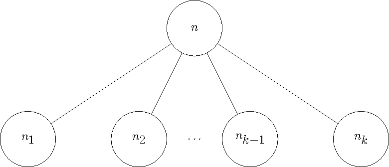

# How MPSGE Works

Work in progress


# Constructing Equations

Consider a production block on sector ``S``. This block will have an input tree
and output tree. The generated equations are different for inputs vs outputs. 
However, they only differ up to a sign in certain locations. Let 
```math
\epsilon = \left\{\begin{array}{cl}
    -1 & \text{Tree is input} \\
     1 & \text{Tree is output}
\end{array}\right.
```
represent this sign. 

## Compensated Demand

Consider a netput tree containing a single nest and ``k`` children, either commodities or 
nests, as in the Figure below. 



Each child node has a quantity ``q_i``. Each commodity node has a reference price ``p_i``, 
base quantity ``Q_i``, reference quantity ``q_i=p_i\cdot Q_i``, variable ``C_i``, 
and taxes ``t_{i,h}``, where the index ``h`` is a consumer. Then ``q = \sum q_i`` 
is the quantity of the root ``n``. The root also has an elasticity ``\sigma``.

The cost function for a commodity node ``n_i`` will be given by ``\pi(n,C_i)`` where
```math
\pi(n,C_i) = \frac{C_i(1-\epsilon\sum_h t_{i,h})}{p_i}.
```
This must be indexed by both the parent nest and commodity as commodities can appear
in a netput tree multiple times, albeit not directly under the same nest. The cost function for
any non-commodity child node is defined recursively in this manner. This is well defined as all
leaves are commodities.

The cost function on the root ``n``, ``C(n)``, depends on the elasticity of the root. If ``\sigma=1``,
the cost function is given by Cobb-Douglass
```math
  C(n) =  \prod_{i=1}^k \pi(n,C_i)^{\frac{q_i}{q}}.
```
And if ``\sigma\ne1`` then we use a CES cost function
```math
C(n) = 
        \left(\sum_{i=1}^k \frac{q_i}{q} \pi(n,C_i)^{1+\epsilon\sigma}\right)^{\frac{1}{1+\epsilon\sigma}}.
```


In general, these trees can be highly nested. Consider a path from the root, ``n_1``
to a leaf ``n_{k+1}``. Using this we can calculate the compensated demand, ``CD(S,C,n_k)``, for the sector
``S``, commodity ``C`` and nest ``n_k``
```math
CD(S,C,n_k) = -\epsilon Q_C \left(\frac{C(n_k)}{\pi(n_k,C)}\right)^{-\epsilon\sigma_k} \prod_{i=1}^{k-1} \left(\frac{C(n_i)}{C(n_{i+1})}\right)^{-\epsilon\sigma_{i}}.
```
Finally, the compensated demand, ``CD(S,C)``, is the summation over all nests that have
``C`` as a leaf.
```math
CD(S,C) = \sum_{\substack{n\text{ nest}\\ \text{if }(n,C)\text{ is an edge}}} CD(S,C,n)
```

For convenience we take any compensated demand not defined above to be 0, this follows
from the empty summation in ``CD(S,C)``.

## ``\tau``
For sector ``S`` and consumer ``H`` define 
```math
\tau(S,H) = - \sum_{\substack{C\in\text{ Commodities}\\n\in\text{ nests}}} CD(S,C,n)\cdot t_{S,C,H,n}\cdot C
```
where ``t_{S,C,H,n}`` is the tax on the commodity ``C`` by consumer ``H`` in sector ``S`` 
under nest ``n``.


## Endowments/Demands
For commodity ``C`` and consumer ``H`` define ``E(H,C)`` to be the endowment quantity.
This is taken to be 0 if there is no endowment for ``H`` and ``C``.

Let ``\sigma`` be the elasticity of demand, ``q_C`` be the quantity of demand for commodity ``C`` in ``H`` consumer demand,
``q = \sum_C q_C`` be the total demand, and ``p_C`` be the reference price of the commodity. Define the demand function, ``D(H,C)``, as
```math
D(H,C) = \frac{q_C}{q}\cdot \frac{H}{C}\cdot \left\{\begin{array}{cc}\frac{p_H\cdot\text{expenditure}(H)}{C}^{\sigma-1} & \sigma\ne1 \\ 1 & \text{otherwise} \end{array}\right.
```
where
```math
\text{expenditure}(H) = \left(\sum_{C\in\text{ demands}(H)} \frac{q_C\cdot C}{q\cdot p_C}\right)^{1/(1-\sigma)}
```

## Constraints
With these definitions, we can define the complementarity constraints. 

### Zero Profit
Let ``S`` be a sector with a production block, then the zero profit condition is 
given by,
```math
\left(\sum_{C\in\text{ Commodities}}CD(S,C)\cdot C\right) - \sum_{H\in\text{ Consumers}} \tau(S,H) \perp S.
```


### Market Clearance
Let ``C`` be a commodity, then the market clearance condition is given by,
```math
\left(\sum_{S\in\text{ Sectors}} CD(S,C)\cdot S \right) - \sum_{H\in\text{ Consumers}} E(H,C) - D(H,C) \perp C.
```

### Income Balance
Let ``H`` be a consumer, then the income balance condition is given by,
```math
H - \left(\sum_{C\in\text{ Commodities}} E(H,C)\cdot C - \sum_{S\in\text{ Sectors}}\tau(S,H)\cdot S\right) \perp H
```
